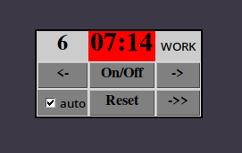

# pymodoro.py

A gui pomodoro timer written in python.

**Dependencies:**
* tkinter (for gui)
* ffplay (from ffmpeg for playing notification sound)
* notify-send (for popups)

**Keyboard shortcuts:**
* subtract one minute from countdown (Right arrow)
* add one minuter to timer (Left arrow)
* Start/stop (space)
* Reset (r)

# pomodoro.py

A simple terminal pomodoro timer. It lacks functionality to pause/play, reset and move forward.

**Dependencies:**
* ffplay (from ffmpeg for playing notification sound)
* notify-send (for popups)

# passgen.py

A full featured, simple password generator.\

**Dependencies:**
* pyperclip (pip3 install pyperclip)

from help me file:

usage: passgen [-h] [-l] [-u] [-d] [-s] [-c] [-f] [-n N] [--include INCLUDE]
               [--exclude EXCLUDE] [-r R]

Generate a password

|options:||
|--|--|
  |-h, --help         |show this help message and exit|
  |-l                 |use lowercase|
  |-u                 |use uppercase|
  |-d                 |use digits|
  |-s                 |use symbols|
  |-c                 |copy password to clipboard|
  |-f                 |Require password to include every specified type of characters|
  |-n N               |password length (default 16)|
  |--include INCLUDE  |characters to include 'in singlequotes'|
  |--exclude EXCLUDE  |characters to exclude 'in singlequotes' (supersedes --include flag)|
  |-r R               |'repeats', amount of passwords to be generated. (default 1)|
